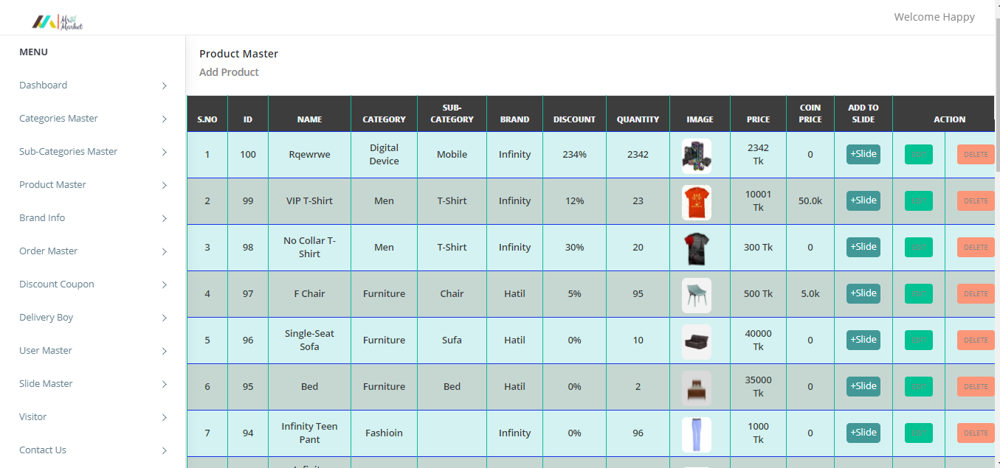
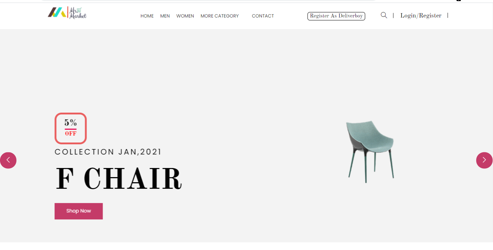
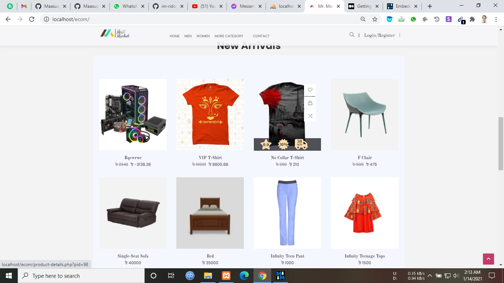
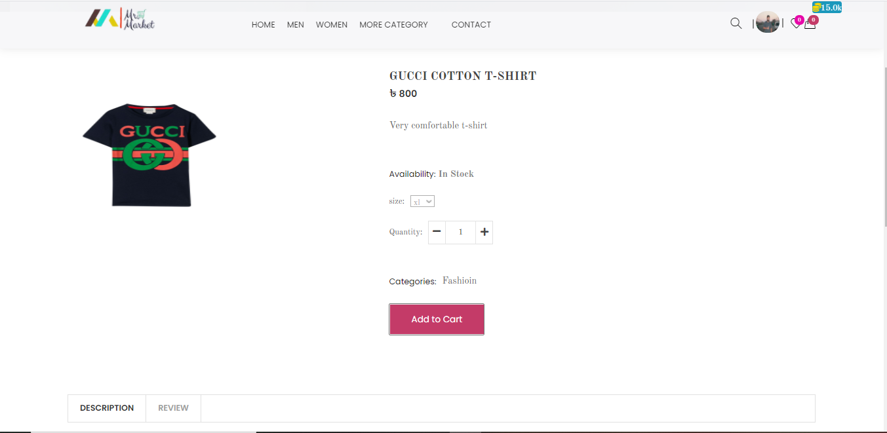
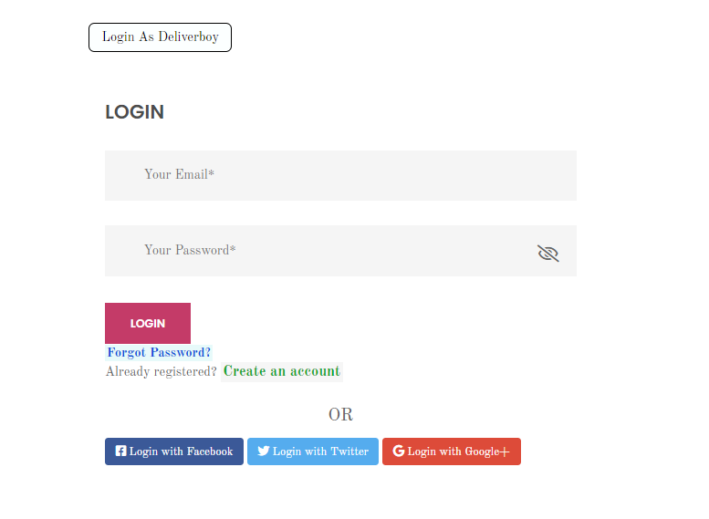
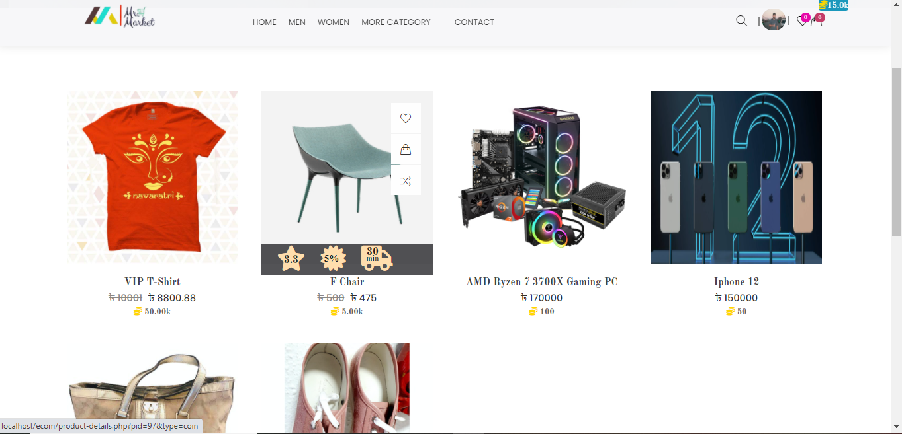
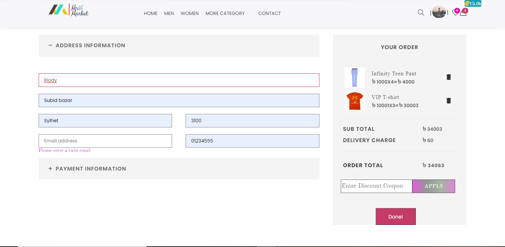
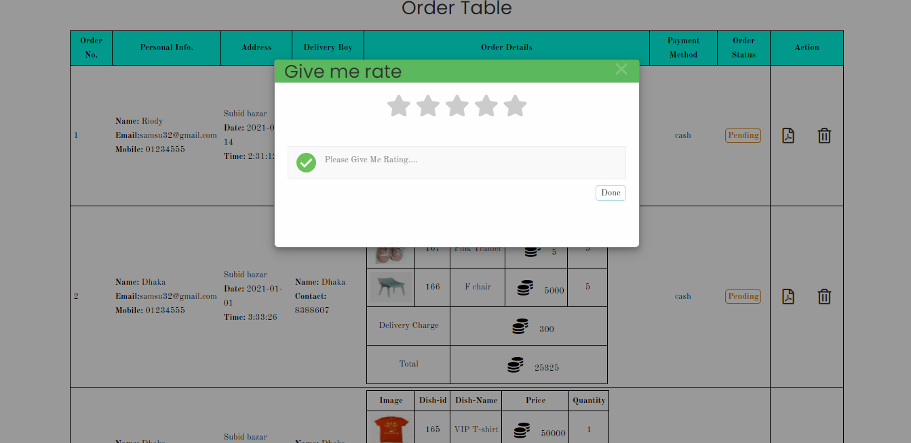
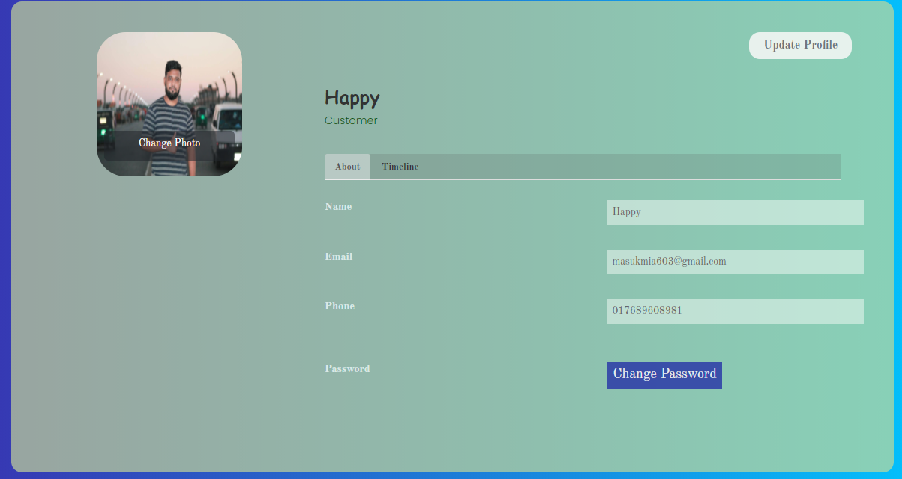

# Mr. Market Website Using PHP
### Description
It is a e-commerce website.
There has 3 panels those are  
* Admin panel
* User Panel 
* Brand Panel

In home page shows those are product which are inserted by individual brand with admin permission. And brand will be registered providing their right information. Also delivery boy can register for delivery the order product. There has another different things that is coin method. User can buy a product using coin those are earn by done those previous orders review which was brought by amount of money.

### :computer: Use Techonology
* HTML5, CSS3, BOOTSTRAP, JS
* PHP, JQUERY, AJAX
* MYSQL

And some third party libraries.

### :camera: Screen Shot :camera:

:camera: **Admin-Panel**

:camera: **Brand-Panel**

:camera: **Slider section** 
 

:camera: **Product section** 

:camera: **Product Details**

:camera: **Login Section**

:camera: **Coin Product**

:camera: **Cart Table**

:camera: **Checkout Section**

:camera: **Order Review**

:camera: **Update-Profile**

